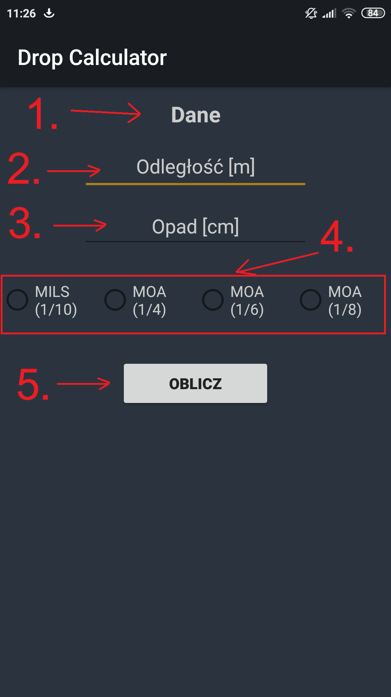

# Drop Calculator 

Drop Calcaulator is a mobile android app which calcuates the correction you need to carry on your scope.

## Why I made this app?

I made this application because I like long range shooting and this basic app will support me and my mates in our hobby

## Language

App is in polish[PL] 
</br>
``
  - In the near future I will add support for english version
``

## Installation

To instal this application you will need mobile phone with android.

## How to use this app?

When the app was successfully installed, search for "Drop Calculator" and start it.
You should see something like that: 
<p align="center">
  
</p>

```
1. Title that says "Here is a place to add data".
2. In this field you need to place on which range you were shooting [in meters].
3. Here you need to add how many cm the bullets hit the point of targeting.
4. You need to choose which type of scope you're using
5. Click this button to calculate.
```
If all was good you should see which correction you need to do.

## Project status 

At this moment I stoped working at this project.

